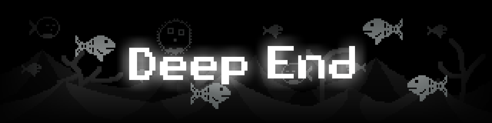

# The deep end

A new mission has been sent to you, diver. You'll have to go to the bottom of the Mariana Trench and discover all the secrets it's hiding from us. Don't let us down... this will be your last chance.

---

This game was inspired by a game called 23 Miles deep, released in 2019 by Odd Giant (Known in Brazil as Amdre young) in the play store. The game was removed from store since no updates had been released for two years, so Google removed the app from the store.

This project tries to revive this game, since it has incredible potential, rewritting it from scratch in a new engine we will be improving everything the old game had, adding new content and other stuff.

## Description of 23 Miles Deep (Original description)

You have the mysterious quest of diving to the bottom of a 23 miles deep trench, home to all kinds of fishes, deep sea creatures, a lost civilization and a few friendly faces.

Key Features:

- Easy controls

- Challenging gameplay

- Progressive upgrades

---

#fangame  #horror #adventure #deepdive #underwater #monochromatic  #strategy #arcade #other